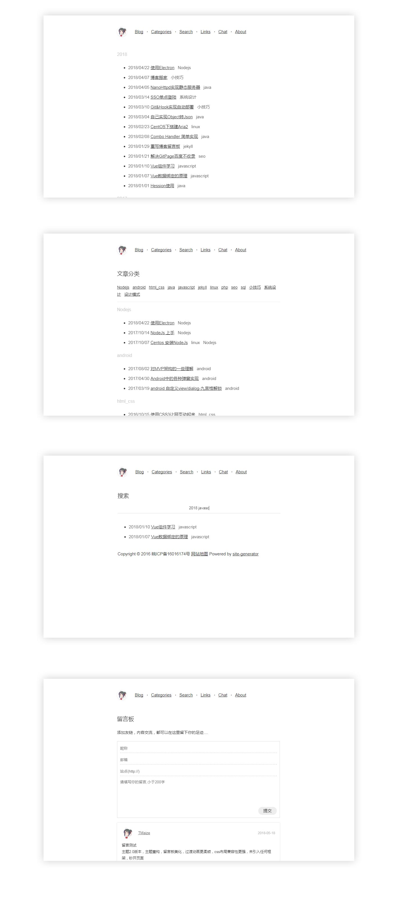

# 介绍

这是 Julian Hawk 的个人博客。

本博客基于[Tmaize](http://blog.tmaize.net/pages/about.html)制作的 jekyll 主题，简洁纯净，支持自适应。

下面有具体的样式截图，或者你可以到Ta的博客查看，当然，如果坚持要看我的博客也不是不可以：）

[TMaize的Blog预览](http://blog.tmaize.net/) 

[TMaize的Github地址](https://github.com/TMaize/tmaize-blog) 

# 移动端截图

# PC 端截图

