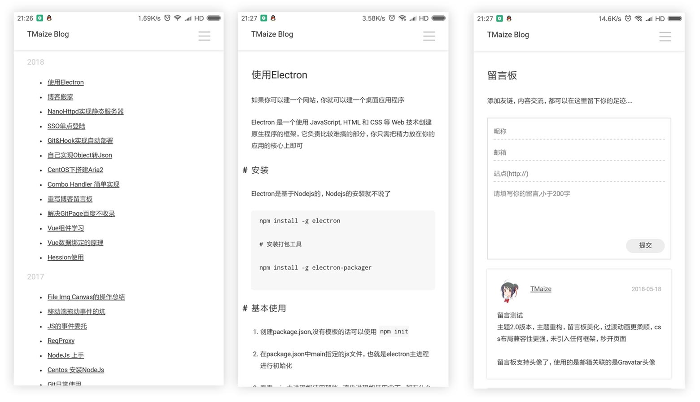

# 介绍

欢迎光临Julian Hawk的博客。

本博客基于Tmaize制作的jekyll 主题，未引入任何框架，秒开页面，简洁纯净，支持自适应。

下面有具体的样式截图，或者你可以到Ta的博客查看，当然，如果坚持看我的博客也不是不可以：）。

[TMaize的Blog预览](http://blog.tmaize.net/) 

[TMaize的Github地址](https://github.com/TMaize/tmaize-blog) 

# 移动端截图

# PC 端截图

